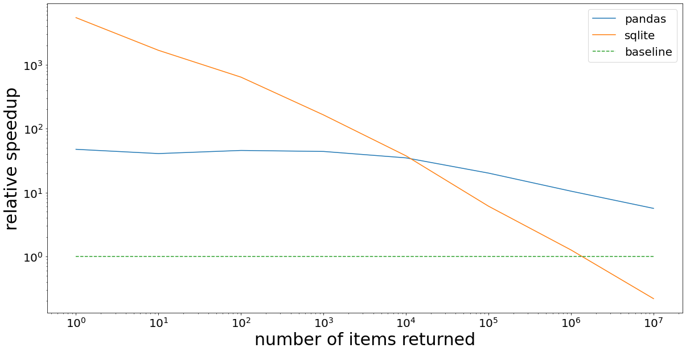

# Tabulated

[](https://github.com/manimino/tabulated/actions)
[](https://github.com/manimino/tabulated/actions)

Containers for finding Python objects by attribute. Backed by SQLite and Pandas.

`pip install tabulated`

____

### Usage
```
from tabulated import LiteBox
tb = LiteBox(
    [{'item': 1, 'size': 1000, 'shape': 'square'}],  # provide a list of objects or dicts 
    {'size': int, 'shape': str})                     # specify attributes to store
tb.find('size >= 1000 and shape == "square"')        # find by attribute value
```

The objects can be any container of `class`, `dataclass`, `namedtuple`, or `dict` objects.

There are two classes available.
 - `LiteBox`: SQLite-backed container. Faster when finding a few of your objects (< 10%).
 - `PandasBox`: Pandas-backed container. Faster when finding many of your objects (>= 10%). 

You can `add()`, `add_many()`, `update()`, and `remove()` items from a LiteBox or PandasBox.

____

### How it works

When you do: `LiteBox(list_of_objects, on={'size': int, 'shape': string})` or `PandasBox(...)`

A table or dataframe is created with 3 columns:
 - size
 - shape
 - Python object reference

On `find()`, a query will run to find the matching objects.

Only the relevant attributes of the object are copied into the table. The rest of the object remains in memory.

An ideal use case is when you have "heavy" objects containing images / audio / large texts, plus some small
metadata fields that you want to find by. Just make a LiteBox or PandasBox on the metadata, and use it to find
the object without needing to serialize / deserialize the heavy stuff.

The `tabulated` containers are especially good when finding by `<` and `>`. If you only need `==`, consider 
[filtered](https://pypi.org/project/filtered/) -- it is based on dict lookups which are faster in that case. 

____

## API

The API is largely the same across LiteBox and PandasBox. The only difference is initialization.

### LiteBox Init 

```
LiteBox(
        objs: Optional[Iterable[Any]] = None,
        on: Optional[Dict[str, Any]] = None,
        index: Optional[List[ Union[Tuple[str], str]]] = None
)
```

Creates a LiteBox.

 - `objs` is optional. It can be any container of class, dataclass, dict, or namedtuple objects.
 - `on` is required. It specifies the attributes and types to index. The allowed types are float, int, bool, and str.
 - `index` specifies the indices to create on the SQLite table. If unspecified, a single-column index is made on each
attribute. 

The `index` parameter is the key to getting good performance. A multi-column index can often speed up `find()` 
operations. `index=[('a', 'b', 'c'), 'd']` will create a multi-column index on `(a, b, c)` and a single-column index 
on `d`.  Conversely, some columns such as those containing string data may perform better without an index.

See [SQLite index documentation](https://www.sqlite.org/queryplanner.html) for more insights.

### PandasBox Init

Creates a PandasBox.

```
PandasBox(
        objs: Optional[Iterable[Any]] = None,
        on: Optional[Dict[str, Any]] = None,
        : Optional[List[ Union[Tuple[str], str]]] = None
)
```

## Other API functions

The remaining functions are the same for both PandasBox and LiteBox; exceptions as noted.

### find()

`find(where: Optional[str]) -> List` finds objects matching the query string in `where`.

Examples: 
 - `tb.find('b == True and string == "okay"')`
 - `tb.find('(x == 0 and y >= 1000.0) or x == 9')`

If `where` is unspecified, all objects in the container are returned. 

The syntax of `where` is nearly identical between pandas and sqlite. Exceptions:
 - In sqlite, use `find('x is null')` / `find('x is not null')`. 
 - In pandas, use `find('x != x')` to match nulls, or `find('x == x')` for non-nulls. 
 - Sqlite accepts either `=` or `==` for equality; pandas accepts only `==`.
 
Consult the syntax for [SQLite queries](https://www.sqlite.org/lang_select.html) or 
[pandas queries](https://pandas.pydata.org/docs/reference/api/pandas.DataFrame.query.html) as needed.

### add(), add_many()

```
add(obj:Any)
add_many(objs:Iterable[Any])
```

The `add()` method adds a single object. If you have many objects, it is much faster to `add_many()` than it is to
call `add()` on each one.

If an added object is missing an attribute, the object will still be added. The missing attribute will be given a 
`None` value.

### update()

`update(self, obj: Any, updates: Dict[str, Any])` updates attributes of a single object in the index.

`updates` is a dict containing the new values for each changed attribute, e.g. `{'x': 5.5, 'b': True}`.

If you change an indexed object's attributes without calling `update()`, the Tabulated will be out of sync and
return inaccurate results. 

`update()` will changes both the value in the Tabulated table and the object's value.

Update is fast (less than 1 ms), it's O(log n) in both sqlite and pandas.

### remove()

`remove(self, obj: Any)` removes an object. 

Remove is fast (less than 1ms) in SQLite but slower (tens of ms) in Pandas. 
This is because removing an item requires rebuilding arrays there.

### Container methods

You can do the usual container things:
 - Length: `len(tb)`
 - Contains: `obj in tb`
 - Iteration: `for obj in tb: ...`

____

## Performance

|                 | Baseline | SqliteBox  | PandasBox |
|-----------------|----------|------------|-----------|
| Find 1 item     | 0.9s     | 0.2ms      | 43.1ms    |
| Find 10 items   | 0.9s     | 0.7ms      | 44.9ms    |
| Find 100 items  | 1.0s     | 1.9ms      | 43.8ms    |
| Find 1K items   | 1.0s     | 6.7ms      | 43.9ms    |
| Find 10K items  | 1.1s     | 27.2ms     | 47.6ms    |
| Find 100K items | 1.2s     | 0.18s      | 88.3ms    |
| Find 1M items   | 1.7s     | 1.37s      | 0.24s     |
| Find 10M items  | 2.9s     | 10.6s      | 0.45s     |

This is a benchmark on random range queries against a dataset of 10 million (10^7) objects indexed on two numeric 
fields. `Baseline` is a Python list comprehension.




This is the same data as a graph, showing relative speedup. Each line is divided by `baseline`. 
Note that both axis labels are powers of 10. So `10^3` on the Y-axis indicates a 1000X speedup.

See [examples](/examples) for more performance tests.
