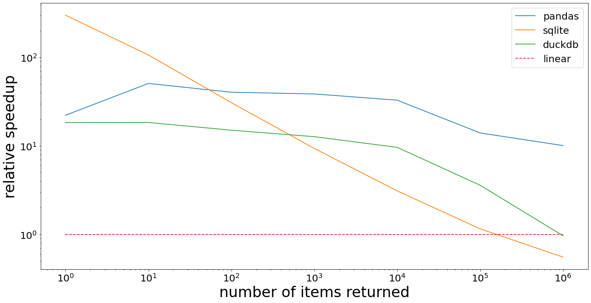

# RangeIndex

[](https://github.com/manimino/rangeindex/actions)

Container for finding Python objects by `<`, `<=`, `==`, `>=`, `>` on their attributes.

`pip install rangeindex`

### Usage
```
from rangeindex import RangeIndex
ri = RangeIndex(list_of_objects, on={'size': int, 'brightness': float})
matching_objects = ri.find('size >= 1000 and brightness > 0.5')
```

You can `add()`, `add_many()`, `update()`, and `remove()` items from a RangeIndex.

### How it works

When you do: `RangeIndex(list_of_objects, on={'size': int, 'brightness': float})`

A table is created with 3 columns:
 - size
 - brightness
 - Python object reference

On `find()`, a query will run to find the matching objects.

### Example

You have a million cat photos. Find big, bright pictures of Tiger The Cat.

```
import random
import time
from rangeindex import RangeIndex


class CatPhoto:
    def __init__(self):
        self.width = random.choice(range(200, 2000))
        self.height = random.choice(range(200, 2000))
        self.brightness = random.random() * 10
        self.name = random.choice(["Luna", "Willow", "Elvis", "Nacho", "Tiger"])
        self.image_data = "Y2Ugbidlc3QgcGFzIHVuZSBjaGF0dGU="


# Make a million
photos = [CatPhoto() for _ in range(10 ** 6)]

# Build RangeIndex
ri = RangeIndex(
    photos,
    on={"height": int, "width": int, "brightness": float, "name": str},
    engine="sqlite",
    table_index=[("width", "height", "brightness")],
)

# Find matches
import time

t0 = time.time()
matches = ri.find(
    "height > 1900 and width >= 1900 and brightness >= 9 and name='Tiger'"
)
print('Found', len(matches), 'matches.')
```

In this case, RangeIndex `find()` is more than 10x faster than the equivalent Python expression:

`matches = [p for p in photos if p.height >= 1900 and p.width >= 1900 and p.brightness >= 9 and p.name='Tiger']`

### Engine Comparison

RangeIndex has two engines available, `sqlite` and `pandas`. The default is `sqlite`.

If your queries typically return just a few results, use `engine='sqlite'`. But if you're doing full table 
scans often, `engine='pandas'` will be faster. 

#### Time Comparison

|                | Baseline | Sqlite | Pandas |
|----------------|----------|--------|--------|
| Get 1 item     | 1.14s    | 0.9ms  | 41.7ms |
| Get 10 items   | 1.10s    | 2.7ms  | 42.4ms |
| Get 100 items  | 1.09s    | 9.6ms  | 42.5ms |
| Get 1K items   | 1.20s    | 46.8ms | 48.9ms |
| Get 10K items  | 1.30s    | 0.28s  | 83.6ms |
| Get 100K items | 1.83s    | 2.16s  | 0.198s |
| Get 1M items   | 2.61s    | 7.95s  | 0.431s |
| Get 10M items  | 2.64s    | 8.11s  | 0.45s  |

This is a benchmark on random-range queries against a dataset of 10 million (10^7) objects indexed on two numeric 
fields. `Baseline` is a Python list comprehension.

#### Graph



This is the same data in graph form, showing relative speedup. Each line is divided by `baseline`. 
Note that both axis labels are powers of 10. So `10^3` on the Y-axis indicates a 1000X speedup.

## Methods

### Init

```
RangeIndex(
        objs: Optional[Iterable[Any]] = None,
        on: Optional[Dict[str, Any]] = None,
        engine: str = SQLITE,
        **kwargs
)
```

Creates a RangeIndex.

`objs` is optional. It can be any collection of `class`, `dataclass`, or `namedtuple` objects.

`on` is required. It specifies the attributes and types to index. 
The allowed types are `float`, `int`, `bool`, and `str`.

`engine` is either `'sqlite'` or `'pandas'`, defaults to `sqlite`. Pandas is an optional dependency, so 
`pip install pandas` if you want to use the `engine='pandas'`.

If the engine is sqlite, you may optionally specify `table_index`. This controls the table index that SQLite uses when 
performing queries. If unspecified, a single-column index is made on each
attribute. Example: `table_index=[('a', 'b', 'c'), ('d')]` will create a multi-column index on `(a, b, c)` and a 
single-column index on `d`. Multi-column indexes will often speed up `find()` operations; see 
[SQLite documentation](https://www.sqlite.org/queryplanner.html).

### add(), add_many()

```
add(obj:Any)
add_many(objs:Iterable[Any])
```

You can add a single object with `add()`. If you have many objects, it is much faster to `add_many()` than it is to
call `add()` on each.

If an added object is missing an attribute, the object will still be added. The missing attribute will be given a 
null value in the index.

### find()

`find(where: Optional[str]) -> List` finds objects matching the query string in `where`.

Examples: 
 - `ri.find('b == True and string == "okay"')`
 - `ri.find('(x == 0 and y >= 1000.0) or x == 9')`

If `where` is unspecified, all objects in the RangeIndex are returned. 

The syntax of `where` is nearly identical between pandas and sqlite. The only difference is in matching null 
values. 
 - In sqlite, use `find('x is null')` / `find('x is not null')`. 
 - In pandas, use `find('x != x')` to match nulls, or `find('x == x')` for non-nulls. 

Consult the syntax for [SQLite queries](https://www.sqlite.org/lang_select.html) or 
[pandas queries](https://pandas.pydata.org/docs/reference/api/pandas.DataFrame.query.html) as needed.

### update()

`update(self, obj: Any, updates: Dict[str, Any])` updates attributes of a single object in the index.

`updates` is a dict containing the new values for each changed attribute, e.g. `{'x': 5.5, 'b': True}`.

If you change an indexed object's attributes without calling `update()`, the RangeIndex will be out of sync and
return inaccurate results. 

`update()` will changes both the value in the RangeIndex table and the object's value.

Update is very fast in SQLite, but slower in Pandas since object lookup is O(n) there.

### remove()

`remove(self, obj: Any)` removes an object. 

Remove is very fast in SQLite, but slower in Pandas since object lookup is O(n) there. Pandas also needs to rebuild
some data structures when an object is removed.

### Container methods

You can do the container things:
 - Length: `len(ri)`
 - Contains: `obj in ri`
 - Iteration: `for obj in ri: ...`
